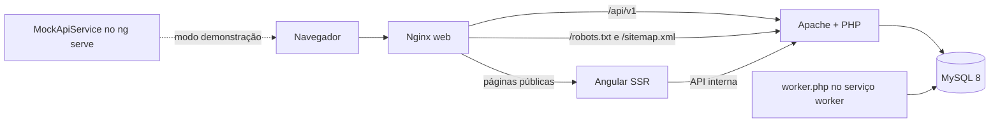

# ChezVoust Pro — arquitetura atual e evolução

> Estado reconciliado em 22 de agosto de 2026 por inspeção estática e build Angular. “Implementado”
> indica que o componente existe no código; desempenho, acessibilidade, segurança e
> operação ainda dependem da fase final de validação descrita em `ACCEPTANCE.md`.

## Visão executável atual

A solução é um monólito modular local: Angular standalone no navegador, Nginx como
servidor/proxy no container web, um processo Angular SSR para as páginas públicas,
API REST em PHP 8.4/Apache e MySQL 8.4.



No desenvolvimento com `npm start`, `environment.ts` usa a API real por `/api/v1` e o
servidor Angular a encaminha a `localhost:8080`. O modo demonstrativo isolado permanece
disponível com `npm run start:mock`. No build de produção usado pelo Compose,
`environment.prod.ts` também usa a API real e o Nginx encaminha esse prefixo ao serviço
`api`. No Compose, o Nginx atende assets versionados diretamente e encaminha rotas
públicas ao SSR; painéis autenticados continuam client-side e recebem `noindex`.
`robots.txt` e `sitemap.xml` são gerados pela API a partir do catálogo e dos perfis
aprovados.

O Compose inclui um serviço worker que executa `worker.php` a cada 30 segundos. Fora dos
containers, ele precisa ser agendado separadamente. A expiração crítica também é
revalidada nas operações de agenda, sem depender somente da execução eventual.

## Organização real do código

```text
backend/
  public/index.php                front controller HTTP
  router.php                      roteador para o servidor embutido do PHP
  bootstrap/                      autoload e montagem de serviços
  config/app.php                  configuração por ambiente
  routes/api.php                  rotas e autorização por papel
  src/Core/                       DB, router, request/response, JWT, auth, validação
  src/Modules/
    Auth/                         cadastro, sessão, verificação e recuperação
    Users/                        endereços
    Catalog/                      home, categorias, serviços e profissionais
    Bookings/                     cotação, reserva, propostas e agenda
    Engagement/                   favoritos, conversa, notificações e avaliações
    Professionals/                perfil, oferta, disponibilidade e oportunidades
    Admin/                        operação administrativa básica
  bin/                            migrate, seed e worker
frontend/src/app/
  core/
    auth/                         sessão, serviço, guard e interceptor de token
    http/                         cliente HTTP e normalização de erros
    data-access/                  fachada de acesso ao marketplace
    models/                       contratos de domínio compartilhados
    testing/                      API e dados mock para desenvolvimento
  shared/components/              um componente reutilizável por arquivo e barrel público
  layout/                         shells público e autenticado
  features/
    auth/                         shell único e páginas login, cadastro e recuperação
    public/                       rotas, dados estáticos e uma pasta por página pública
    booking/                      página orquestradora, etapas, modelo tipado e storage
    customer/                     rotas e uma pasta por página do cliente
    provider/                     rotas e uma pasta por página profissional
    messaging/                    mensagens compartilhadas entre cliente e profissional
    admin/                        rotas, configuração, modelos e páginas administrativas
database/
  schema.sql                      schema inicial idempotente para banco vazio
  seed.sql                        dados fictícios; hashes são injetados por seed.php
docs/                             produto, arquitetura, API, privacidade e aceite
```

Os módulos PHP atuais são organizados por assunto, mas não possuem camadas separadas de
domínio, repositório e aplicação. Controllers executam SQL parametrizado diretamente e
orquestram regras. Uma futura separação dessas camadas é evolução, não descrição do código
presente.

O frontend usa componentes standalone com `OnPush`, carregamento preguiçoso e arquivos de
rotas por feature. Cada arquivo declara no máximo um componente. Cabeçalhos de portal,
estados assíncronos, métricas e elementos de identidade ficam em `shared/components`.
Autenticação usa um único `AuthShellComponent`, inclusive na recuperação de senha. O fluxo
de reserva mantém efeitos na página orquestradora; as cinco etapas, resumo e confirmação
são componentes de apresentação, enquanto o rascunho versionado fica em `data-access`.

## Componentes e status

| Componente | Estado atual | Limite explícito |
| --- | --- | --- |
| Angular público | Implementado | Validação visual/a11y fica para a fase final. |
| Autenticação Angular | Implementada | Sessão real depende da API; mock é demonstração. |
| Reserva Angular | Integrada ao núcleo disponível | Recorrência e recursos sem endpoint ficam ocultos ou marcados como roadmap. |
| Áreas cliente/prestador/admin | Mistas | Somente ações ligadas a endpoint real são operacionais; fallbacks devem indicar demonstração. |
| API PHP | Implementada para o núcleo listado em `API.md` | Não equivale ao roadmap completo do marketplace. |
| MySQL | Schema e seed implementados | Não há sistema de migrações incrementais versionadas. |
| E-mail/outbox | Implementado | Worker entrega e-mails via Resend quando configurado; desenvolvimento usa log redigido. |
| Upload/armazenamento | Implementado para avatar | Foto de perfil autenticada em JPG/PNG/WebP, validada, redimensionada/convertida para WebP e servida por rota pública controlada. Anexos e galeria profissional permanecem roadmap. |
| KYC, mapas, SMS e seguro | Roadmap | Nenhum fornecedor foi integrado. |

## Modelo de dados implementado

O schema atual contém estas tabelas:

- identidade: `users`, `auth_sessions`, `email_verification_tokens`,
  `password_reset_tokens`;
- prestadores e conta: `professional_profiles`, `addresses`,
  `professional_services`, `availability_rules`, `availability_exceptions`;
- catálogo e configuração: `service_categories`, `services`, `service_addons`,
  `promotions` e `app_settings`;
- reserva e agenda: `bookings`, `booking_items`, `booking_status_history`,
  `booking_offers`, `schedule_day_locks`, `slot_reservations`;
- idempotência: `idempotency_keys`;
- relacionamento: `favorites`, `conversations`, `conversation_participants`,
  `messages`, `notifications`, `reviews`;
- operação: `api_rate_limits`, `audit_logs`, `outbox_events`.

Chaves estrangeiras, unicidades, checks e índices básicos estão definidos no schema.
Valores monetários são persistidos em centavos inteiros. Datas do banco são mantidas em
UTC; endpoints de agenda/reserva devem expor RFC 3339 com fuso explícito.

Não existem atualmente tabelas de documentos/KYC, consentimentos, solicitações de
privacidade, preferências de notificação, service area geográfica, recorrência, galeria
de mídia, ticket ou disputa. Esses conceitos pertencem ao roadmap. Avatares usam um
arquivo interno associado a `users`, sem uma tabela de mídia genérica.

Uma conta possui um único papel em `users.role`: `customer`, `provider` ou `admin`.
Conta simultaneamente cliente e prestador exigirá mudança de modelo no roadmap.

## Fluxos implementados

### Autenticação

1. Cadastro cria usuário, hash de senha e token de verificação.
2. Login valida credencial e cria `auth_sessions` com refresh token armazenado como hash.
3. Access token JWT autoriza rotas; refresh rotaciona a sessão. Uma repetição concorrente do token anterior só recebe access token durante uma janela de 10 segundos, sem regravar o cookie já rotacionado.
4. O access token fica apenas em memória no Angular; o refresh permanece inacessível ao JavaScript.
5. Logout revoga uma ou todas as sessões; o usuário pode listar e revogar outros dispositivos.
6. Verificação e recuperação usam tokens descartáveis e outbox.

O envio externo não está implementado. Em ambiente local/debug, a API pode devolver o
token de demonstração; o worker processa a outbox sem registrar o segredo no log.

### Cotação e reserva

1. A API valida serviço, profissional opcional e parâmetros de preço.
2. `PricingService` recalcula o valor de referência fixo, horário ou por área e os
   adicionais, sem cobrança, cupom, taxa ou comissão da plataforma.
3. A criação valida endereço próprio, horário e prestador.
4. Reserva direta confirma e reserva a agenda; solicitação ao marketplace fica `open`
   para propostas.
5. A API persiste snapshot, itens e histórico.
6. Prestador aprovado pode propor; cliente pode aceitar uma proposta elegível.
7. Participantes autorizados podem cancelar e prestador/admin podem iniciar/concluir nos
   estados implementados.
8. Cliente pode reagendar reserva confirmada; prestador pode registrar chegada, início e conclusão.

Recorrência automática, disputa e política de cancelamento versionada não
fazem parte desse fluxo atual.

### Relacionamento

- favoritos pertencem ao cliente;
- conversas são vinculadas à reserva e limitadas aos participantes;
- mensagens atuais são texto sem anexo;
- o cliente Angular inicia a conversa pelos 50 itens mais recentes e solicita histórico
  anterior sob demanda; atualizações posteriores usam `sequence`, sem requisições
  sobrepostas. A conversa ativa mantém uma única espera autenticada de até 15 segundos
  e reabre-a assim que ela termina, entregando novas mensagens com latência de até um
  segundo; a lista é atualizada a cada quinze segundos;
- a sincronização é suspensa quando a aba fica oculta e retomada imediatamente ao voltar,
  reduzindo tráfego e trabalho do PHP/MySQL;
- cada envio recebe uma `Idempotency-Key`: mensagem, atualização da conversa e notificação
  são persistidas em uma transação, sem duplicar conteúdo em uma repetição de rede;
- notificações podem ser listadas e marcadas como lidas;
- avaliação é criada pelo cliente para reserva concluída e possui unicidade no schema.

## Containers e configuração

O Compose atual:

- inicia MySQL 8.4 com health check e usa `schema.sql` para volumes novos;
- constrói PHP 8.4/Apache, aplica migrações incrementais versionadas e só então executa o seed local;
- monta o diretório do backend e um volume separado para `storage` local;
- constrói Angular para produção e o serve por Nginx na porta configurada;
- publica um health check da API depois das migrações e faz web/worker aguardarem esse estado;
- executa `worker.php` a cada 30 segundos em um serviço dedicado.

O health check de inicialização confirma o processo HTTP migrado, mas não substitui uma
sonda profunda de dependências para um ambiente distribuído de produção.

Com `AUTO_SEED=true` — valor local padrão — o seed recria dados demonstrativos e senhas
conhecidas quando o serviço API inicia. O comportamento pode ser desabilitado e deve
permanecer restrito a ambientes locais descartáveis.

O schema usa `CREATE TABLE IF NOT EXISTS` para bancos vazios. Alterações posteriores ficam
em `database/migrations` e são registradas em `schema_migrations` sob bloqueio no banco.

## Segurança realmente presente

- senha com Argon2id quando disponível e fallback seguro do PHP;
- JWT HS256 com emissor, audiência, tipo, validade e sessão persistida;
- refresh token rotativo armazenado como SHA-256;
- access token mantido somente em memória no navegador e sessão restaurada pelo cookie HttpOnly;
- RBAC por `customer`, `provider` e `admin`, além de verificações de propriedade em rotas;
- PDO com prepared statements reais e validação de entrada;
- CORS por allowlist, rate limit em MySQL, request ID e auditoria administrativa;
- bloqueios transacionais de agenda e chaves de idempotência nas operações cobertas;
- a plataforma não recebe dados de pagamento.

Esses controles não constituem certificação nem prontidão de produção. Permanecem como
trabalho de liberação:

- HTTPS e segredos gerenciados no ambiente definitivo;
- proxy/IP confiável, revisão integral de concorrência e autorização;
- política de retenção/redaction e observabilidade;
- MFA administrativo;
- CSP validada para o frontend;
- uploads privados e antivírus, caso anexos sejam adicionados;
- backup, restauração e resposta a incidente;
- homologação de fornecedores e revisão jurídica/LGPD.

Não há PWA ou service worker no frontend atual. Não há KYC documental. Essas capacidades
não devem aparecer como prontas em documentação ou interface.

## Metas — não medidas nesta entrega

São objetivos de qualidade para a fase final, não resultados já alcançados:

- layout utilizável de 360 a 1440+ px e WCAG 2.2 AA nas jornadas essenciais;
- API comum com p95 alvo abaixo de 500 ms em ambiente de referência;
- LCP alvo até 2,5 s, INP até 200 ms e CLS até 0,1 no percentil 75;
- coleções paginadas onde houver crescimento relevante;
- operações de agenda idempotentes e auditáveis;
- falha de notificação sem reversão de reserva já confirmada.

Nenhuma dessas metas é considerada comprovada antes da fase final de testes.

## Evolução arquitetural priorizada

1. Adaptador real de e-mail, retry/backoff e fila morta para a outbox já agendada.
2. Pipeline de rollback e validação prévia para as migrations incrementais versionadas.
3. Contratos OpenAPI e serialização temporal uniforme.
4. Camadas de aplicação/repositório para reduzir SQL e regra dentro de controllers.
5. Upload privado apenas quando houver requisito e política de retenção aprovados.
6. Service areas, recorrência automática, suporte/disputa, privacidade e permissões granulares.
7. KYC somente após fornecedor, base legal, processo operacional e evidência verificável.

Nenhuma decisão deste documento autoriza publicação ou deploy.
